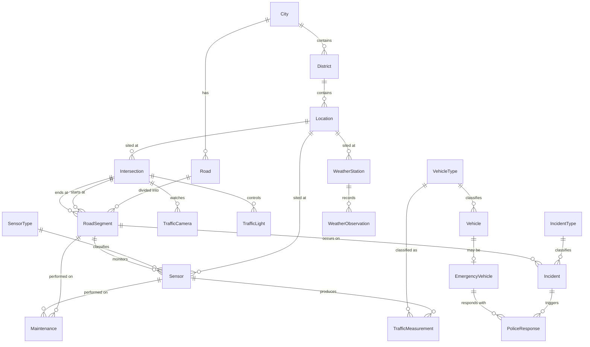

# Part 2 — Source System (OLTP Database)

Database: **`TrafficOLTP`** — the normalized (3NF) operational system that the dispatch and
asset-management applications write to. It is optimized for *transactional integrity*, not
analytics: narrow rows, strong FKs, no redundancy.

Alongside the OLTP database, two **file-based sources** exist (handled by Spark, see doc 07):

- `sensor_readings_YYYYMMDD.csv` — raw detector telemetry (high volume)
- `camera_events_YYYYMMDD.json` — ANPR/camera detection events
- `weather_observations_YYYYMMDD.json` — weather API archive

> **Design note — why some entities from the brief were adjusted:** The brief lists `Date`
> and `Time` as OLTP entities. Calendar tables are an *analytical* construct (Kimball
> conformed dimensions); a 3NF operational system stores native `datetime2` columns instead.
> They are therefore implemented in the warehouse (DimDate/DimTime), not in OLTP. Similarly
> `Weather` is split into `WeatherStation` (asset) and `WeatherObservation` (measurement),
> which is the correct normalization.

## ER Diagram

## Entity Catalogue

| Entity | Purpose | Key business rules |
|--------|---------|--------------------|
| `City`, `District`, `Location` | Geographic hierarchy | Location = geocoded point (lat/long + address) |
| `Road` | Named road | Category: highway / arterial / collector / local |
| `RoadSegment` | Directional stretch of a road between two intersections | Carries lane count + speed limit (changes over time → SCD2 in DW) |
| `Intersection` | Junction node | Type: signalized / roundabout / priority |
| `SensorType`, `Sensor` | Detector assets | Serial number is the immutable business key |
| `TrafficCamera` | ANPR/CCTV asset | Firmware/resolution upgraded in place (SCD1 in DW) |
| `TrafficLight` | Signal controller | TimingPlan replaced by engineering team (SCD3 in DW) |
| `VehicleType`, `Vehicle` | Vehicle classification + registered fleet | Individual vehicles known only for the municipal/emergency fleet; plate stored as salted hash (GDPR) |
| `EmergencyVehicle` | Subtype of Vehicle | 1:0..1 subtype pattern |
| `WeatherStation`, `WeatherObservation` | Weather measurement | One observation per station per 10 min |
| `TrafficMeasurement` | One vehicle detection by one sensor | THE high-volume table; in production this bypasses OLTP and lands as CSV — kept here small for lineage demonstration |
| `IncidentType`, `Incident` | Accidents, breakdowns, roadworks, hazards | Status workflow: Detected → Responded → Cleared → Closed |
| `PoliceResponse` | Dispatch record per incident per unit | Milestone timestamps feed the accumulating snapshot fact |
| `Maintenance` | Work orders on assets/segments | Polymorphic: exactly one target FK set (enforced by CHECK) |

## Keys and Integrity

- Every table has a surrogate `INT IDENTITY` primary key (`<Entity>ID`).
- Natural/business keys carry `UNIQUE` constraints (e.g. `Sensor.SerialNumber`,
  `Road.RoadCode`, `VehicleType.Code`) — these become the **business keys** the warehouse
  uses for SCD matching.
- All FKs declared with `ON DELETE NO ACTION` — operational data is never cascade-deleted;
  assets are soft-retired via `Status`.
- `rowversion`/`ModifiedAt` columns on mutable tables support **incremental extraction**
  (high-watermark pattern, see doc 06).

Implementation: [sql/oltp/01_create_database.sql](../sql/oltp/01_create_database.sql),
[sql/oltp/02_tables.sql](../sql/oltp/02_tables.sql), sample data in
[sql/oltp/03_sample_data.sql](../sql/oltp/03_sample_data.sql).
