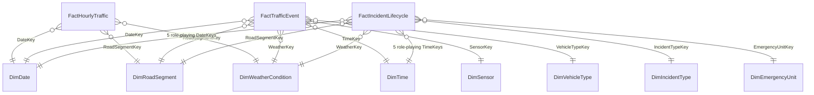

# Part 4 — Dimensional Model (Star Schema)

Database: **`TrafficDW`**, schemas: `dim`, `fact`, `stg` (staging), `etl` (framework), `mart` (report views).

## Star Schema (core star: hourly traffic)

## Design Principles Applied

1. **Surrogate keys everywhere** (`INT IDENTITY`), business keys kept as attributes.
   Insulates the DW from source-key reuse, enables SCD2 history, allows the reserved
   **unknown member (key −1)** and **inferred late-arriving members** (doc 06).
2. **No snowflaking.** `DimRoadSegment` *contains* road name, road category, city, district,
   lat/long. Kimball: storage is cheap, joins are not; BI users get one wide, readable
   dimension. The brief's `DimRoad`/`DimLocation` exist as **views over DimRoadSegment**
   for users who want the coarser rollup — conformed by construction.
3. **Role-playing** `DimDate`/`DimTime` — single physical table, five FK roles on the
   accumulating fact, exposed via named views (`dim.DimDate_Detected`, …).
4. **Junk-free design** — low-cardinality flags live inside their natural dimension
   (e.g. `IsRushHour` in DimTime) instead of a junk dimension; none were left over.
5. **DimVehicle vs DimVehicleType** *(improvement over the brief)* — roadside detectors
   classify ("truck, 2 axles") but do not identify vehicles. A per-vehicle dimension keyed
   into 80M rows/day would be both unrealistic and a privacy problem. `DimVehicleType`
   (≈10 rows) is the analytical dimension; `DimVehicle` is retained only for the registered
   emergency fleet, joined through `DimEmergencyUnit`.
6. **Banded weather** *(improvement)* — instead of one dimension row per weather
   *measurement* (which would be a fact in disguise), `DimWeatherCondition` enumerates
   analytical bands: condition (Dry/Rain/Snow/Fog/Ice) × temperature band × precipitation
   band × visibility band (≈200 rows). Raw numeric readings (`AvgTempC`, `PrecipitationMm`)
   are stored as facts on the hourly snapshot. This is the textbook "banding" pattern and it
   makes weather conform across all three facts.

## Dimension Catalogue

| Dimension | SCD | Rows (approx) | Business key | Notable attributes |
|---|---|---|---|---|
| `DimDate` | 0 | 3,660 (10 yrs) | FullDate | Year, Quarter, Month, WeekOfYear, DayOfWeek, IsWeekend, IsHoliday, Season |
| `DimTime` | 0 | 1,440 (minute grain) | TimeBK (hhmm) | Hour, Minute, HourBand, DayPart, IsRushHour |
| `DimRoadSegment` | **2** | ~2,500 (+history) | RoadSegmentID (OLTP) | RoadName, RoadCategory, City, District, Direction, LaneCount, SpeedLimitKmh, LengthM, Start/EndIntersection |
| `DimWeatherCondition` | 0/1 | ~200 | ConditionCode+bands | Condition, TempBand, PrecipBand, VisibilityBand, IsSevere |
| `DimVehicleType` | 1 | ~10 | TypeCode | Name, Category, WeightClass, IsHeavy |
| `DimSensor` | **2** | ~2,000 (+history) | SerialNumber | SensorType, Technology, Status, RoadSegment ref, InstallDate (Type 0 attribute) |
| `DimTrafficCamera` | **1** | ~500 | CameraCode | Model, Resolution, FirmwareVersion, Status |
| `DimTrafficLight` | **3** | ~800 | ControllerCode | CurrentTimingPlan, **PreviousTimingPlan**, TimingPlanChangeDate, CycleSeconds |
| `DimIncidentType` | 1 | ~15 | TypeCode | Name, Category, DefaultSeverity |
| `DimEmergencyUnit` | 1 | ~150 | UnitCode | UnitType (police/fire/ambulance/tow), HomeStation, VehicleModel |

Every dimension ships with an **Unknown member (surrogate key −1)** and, where late-arriving
members are possible (Sensor, RoadSegment), an *inferred member* mechanism (doc 06).

## Fact Tables (full column-level detail in [sql/warehouse/03_facts.sql](../sql/warehouse/03_facts.sql))

### `fact.FactTrafficEvent` — transaction
- Grain: one vehicle detection. Partitioned by `DateKey` (monthly), clustered columnstore.
- FKs: DateKey, TimeKey, RoadSegmentKey, SensorKey, VehicleTypeKey, WeatherKey.
- Measures: SpeedKmh, HeadwaySeconds, OccupancyPct, SpeedOverLimitKmh. Degenerate: EventID.
- Why transaction type: it *is* the atomic business event; nothing to snapshot or accumulate.

### `fact.FactHourlyTraffic` — periodic snapshot
- Grain: road segment × hour — **a row exists even when no vehicle passed** (density).
- Measures: VehicleCount, HeavyVehicleCount, AvgSpeedKmh, P85SpeedKmh, AvgOccupancyPct,
  CongestionIndex, IncidentCount, AvgTempC, PrecipitationMm.
- Why periodic type: management questions are interval-based ("per hour"), the interval is
  fixed, and absence of activity is itself information.

### `fact.FactIncidentLifecycle` — accumulating snapshot
- Grain: one incident. Row inserted at detection with NULL milestone keys pointing to the
  Unknown date member; each milestone `UPDATE`s its date/time keys and lag measures.
- Milestones: DetectedDate/Time, DispatchedDate/Time, ArrivedDate/Time, ClearedDate/Time,
  ClosedDate/Time. Lags: MinutesToDispatch, MinutesToArrive, MinutesToClear, TotalDurationMinutes.
- Why accumulating type: a finite, well-defined pipeline with milestones; the alternative
  (transaction rows per status change) forces expensive self-joins for every SLA question.

## Rollup Views (`mart` schema)

`mart.vDimRoad`, `mart.vDimLocation` — coarse conformed rollups derived from DimRoadSegment;
`mart.vFactDailyTraffic` — daily aggregate over the hourly snapshot for executive reporting.
