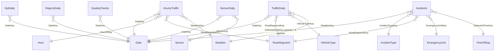

# Part 16 — Power BI Reporting Layer

> Semantic views: [sql/warehouse/07_powerbi_views.sql](../sql/warehouse/07_powerbi_views.sql).
> The five dashboards below implement the dashboard catalogue promised in
> [doc 01 §6](01_business_analysis.md) on top of the star schema — nothing here
> touches the OLTP database.

## 1. Architecture of the reporting layer

```
 fact / dim (star schema)  ──►  mart.vPbi* semantic views  ──►  Power BI import model
                                (the ONLY objects the        (5 report pages + drill-
                                 .pbix is allowed to read)     throughs, DAX measures)
```

**Design decisions (and why):**

| Decision | Rationale |
|---|---|
| **Import mode**, refreshed after the nightly batch | The business contract is nightly/hourly analytics (doc 01); import gives sub-second visuals and works offline for demos. DirectQuery over the columnstore remains a documented fallback for the event grain. |
| Model reads **views, not tables** | A stable contract: dimension/fact refactors never break the .pbix; the view layer is where BI-friendly renames live. |
| **Event fact imported as daily aggregates** (`vPbiTrafficDaily`, `vPbiSensorDaily`) | 80M rows/day at target scale cannot be imported; the Kimball aggregate-table pattern keeps the model laptop-sized while hourly and incident grains import at native grain. |
| SCD2 dimension views expose **all versions** + `IsCurrentVersion` | Facts reference historical surrogate keys; filtering to current rows would orphan fact rows. "As-is" reporting slices on `IsCurrentVersion = 1`. |
| `vPbiDate` **excludes the −1 member** | "Mark as date table" requires a gap-free, non-null date column (enables built-in time intelligence). Facts keyed to −1 fall into the automatic (Blank) member. Every other dimension keeps −1 so unknowns appear as an explicit *Unknown* bucket. |
| No `.pbix` committed to the repo | Binary files don't diff (doc 11). This document plus the views *is* the reproducible definition; the build checklist below recreates the file in ~an hour. |

## 2. Semantic model

### Tables (all from `mart.vPbi*`)

| Model table | Source view | Grain | Role |
|---|---|---|---|
| Date | `vPbiDate` | day | conformed date (marked as date table) |
| Hour | `vPbiHour` | hour (24) | hour-of-day slicing for the hourly fact |
| Time of Day | `vPbiTimeOfDay` | minute (1,440) | incident milestone times |
| Road Segment | `vPbiRoadSegment` | SCD2 version | central conformed dimension |
| Sensor | `vPbiSensor` | SCD2 version | asset dimension |
| Weather | `vPbiWeather` | condition band | conformed weather |
| Vehicle Type | `vPbiVehicleType` | type | vehicle mix |
| Incident Type | `vPbiIncidentType` | type | incident classification |
| Emergency Unit | `vPbiEmergencyUnit` | unit | response analysis |
| Traffic Light | `vPbiTrafficLight` | controller | SCD3 retiming before/after |
| Hourly Traffic | `vPbiHourlyTraffic` | segment × hour | main fact |
| Incidents | `vPbiIncidents` | incident | accumulating fact + SLA flags |
| Traffic Daily | `vPbiTrafficDaily` | day × segment × vehicle type × weather | event-fact aggregate |
| Sensor Daily | `vPbiSensorDaily` | day × sensor | sensor health fact |
| KPI Daily | `vPbiKpiDaily` | day | executive scorecard fact |
| Rejects Daily | `vPbiRejectDaily` | day × reason × sensor | quarantine metrics |
| ETL Batches | `vPbiEtlBatches` | batch | pipeline health |
| Quality Checks | `vPbiQualityChecks` | check run | quality-gate results |

### Relationships



All relationships single-direction (dimension filters fact), many-to-one.
**Role-playing dates:** `Incidents[DetectedDateKey] → Date` is the *active*
relationship; Dispatched/Arrived/Cleared/Closed date keys are *inactive*
relationships activated per-measure with `USERELATIONSHIP` — the tabular-model
equivalent of the warehouse's role-playing views (doc 04 §3).

### Core DAX measures

```dax
Total Vehicles        := SUM ( HourlyTraffic[VehicleCount] )
Heavy Share %         := DIVIDE ( SUM ( HourlyTraffic[HeavyVehicleCount] ), [Total Vehicles] )

-- volume-weighted, matching the warehouse definition (doc 01 KPI table)
Avg Speed (weighted)  := DIVIDE (
                             SUMX ( HourlyTraffic, HourlyTraffic[AvgSpeedKmh] * HourlyTraffic[VehicleCount] ),
                             [Total Vehicles] )
Congestion Index      := DIVIDE (
                             SUMX ( HourlyTraffic, HourlyTraffic[CongestionIndex] * HourlyTraffic[VehicleCount] ),
                             [Total Vehicles] )

Vehicles PY           := CALCULATE ( [Total Vehicles], SAMEPERIODLASTYEAR ( 'Date'[Date] ) )
Vehicles YoY %        := DIVIDE ( [Total Vehicles] - [Vehicles PY], [Vehicles PY] )

Incident Count        := COUNTROWS ( Incidents )
Response P90 (min)    := PERCENTILEX.INC ( Incidents, Incidents[MinutesToArrive], 0.90 )
Response SLA %        := AVERAGE ( Incidents[MetResponseSla8Min] )      -- 1/0 flag from the view
Clearance P50 (min)   := PERCENTILEX.INC ( Incidents, Incidents[MinutesToClear], 0.50 )

-- role-playing example: incidents by CLOSED date instead of detected date
Incidents Closed      := CALCULATE ( COUNTROWS ( Incidents ),
                             USERELATIONSHIP ( Incidents[ClosedDateKey], 'Date'[DateKey] ) )

Sensor Uptime %       := AVERAGE ( SensorDaily[UptimePct] )
Reject Rate %         := DIVIDE ( SUM ( RejectsDaily[RejectedRows] ),
                             SUM ( RejectsDaily[RejectedRows] ) + SUM ( SensorDaily[Detections] ) )
Speeding Share %      := DIVIDE ( SUM ( TrafficDaily[SpeedingDetections] ), SUM ( TrafficDaily[Detections] ) )
```

### Shared drill-down hierarchies (defined once, reused on every page)

| Hierarchy | Levels |
|---|---|
| **Geography** | City → District → RoadName → SegmentCode |
| **Calendar** | Year → Quarter → Month → Date |
| **Time of day** | DayPart → HourBand → HourOfDay |
| **Vehicle** | Category → TypeName |

---

## 3. Dashboard catalogue

### 3.1 Executive Dashboard

| | |
|---|---|
| **Purpose** | One-screen answer to "are the smart-city KPIs improving?" — the monthly scorecard for doc 01 goals G1–G5. |
| **Target users** | City leadership / mayor's office; monthly review cadence. |
| **Primary data** | KPI Daily, Hourly Traffic, Incidents. |

**KPIs (card row with trend sparklines + RAG conditional formatting):**
Congestion Index (target < 0.35) · Total Vehicles · Avg Speed (weighted) ·
Incident Count · Response SLA % (target: P90 < 8 min) · Sensor Health %.

**Charts:**
- Line: Congestion Index by month, with target constant line (0.35).
- Column + line combo: Total Vehicles (columns) vs Vehicles YoY % (line) by month.
- Line: Response P90 (min) by month with 8-minute target line.
- Bar: Congestion Index by District (top 10, descending).
- KPI matrix: the 9 KPIs of doc 01 §5 as rows, months as columns, RAG icons.

**Slicers:** Year, Quarter, City, District.
**Drill-down:** Calendar hierarchy on all trend visuals (Year → Quarter → Month → Date); Geography hierarchy on the district bar.
**Drill-through:** right-click a district → *Corridor Detail* page (3.2); right-click a month in the response trend → *Incident Detail* page (3.3).
**Business questions answered:** doc 01 requirements #9 (monthly/yearly trends, YoY), #13 (composite indicators); goals G1, G2 progress tracking.

### 3.2 Traffic Operations Dashboard

| | |
|---|---|
| **Purpose** | Tactical view for the Traffic Management Center: which corridors degraded, where, at which hours — this week vs. baseline. |
| **Target users** | TMC operators; daily/weekly review. |
| **Primary data** | Hourly Traffic, Road Segment, Hour, Weather. |

**KPIs:** Network Congestion Index (selected period) · Worst-segment congestion · Peak Hour Volume · Segments with CongestionIndex > 0.5 (count).

**Charts:**
- **Matrix heatmap** — rows: RoadName (drill to SegmentCode), columns: HourOfDay, values: Congestion Index with color scale. *The* rush-hour picture.
- Map (Azure Maps / bubble): segments by Latitude/Longitude, bubble size = Total Vehicles, color = Congestion Index.
- Line: Avg Speed (weighted) by HourOfDay, legend = IsWeekend — the daily speed profile.
- Ranked bar: Top 15 segments by Congestion Index, tooltip shows SpeedLimitKmh vs avg speed.
- Area: Total Vehicles by HourOfDay stacked by DayPart.

**Slicers:** Date range, City/District, RoadCategory, IsRushHour, Weather ConditionName.
**Drill-down:** Geography hierarchy (City → District → Road → Segment) on heatmap, map and ranked bar; Time-of-day hierarchy on profiles.
**Drill-through:** *Corridor Detail* page — filtered to one road/segment: hourly speed & volume curves per day, weather overlay, incident markers, segment attributes card (lanes, limit, length, direction — incl. SCD2 version history table).
**Business questions answered:** doc 01 #1 (busiest roads/segments), #3 (hour-of-day/day-of-week variation), #4 (peak hours per road/district), #12-adjacent congestion ranking (requirement #2).

### 3.3 Incident Analysis Dashboard

| | |
|---|---|
| **Purpose** | The emergency-response funnel: detection → dispatch → arrival → clearance; SLA attainment and hotspots. |
| **Target users** | Police & emergency services command; weekly SLA review. |
| **Primary data** | Incidents, Incident Type, Emergency Unit, Road Segment, Date (role-playing). |

**KPIs:** Incident Count · Response P90 (min) vs 8-min target · Clearance P50 (min) vs 45-min target · Response SLA % · Open incidents (IsClosed = 0).

**Charts:**
- **Funnel decomposition** — stacked bar per incident: avg MinutesToDispatch / MinutesToArrive / MinutesToClear by IncidentType (where is the pipeline slow?).
- Gauge: Response SLA % against 90% target.
- Map: incident hotspots (segment lat/long), bubble size = count, color = avg severity — enforcement placement.
- Column: incidents by DetectedTimeKey's HourBand — when do incidents happen?
- Donut: severity mix (1–5) with LanesBlocked tooltip.
- Bar: Response P90 by Emergency Unit HomeStation — staffing evidence.
- Scatter: MinutesToArrive vs MinutesToClear by incident, color = Weather IsSevere.

**Slicers:** Date range (detected), Incident Category, Severity, UnitType, District, Weather condition.
**Drill-down:** IncidentType Category → TypeName; Geography hierarchy on the map.
**Drill-through:** *Incident Detail* page — single incident: milestone timeline (detected/dispatched/arrived/cleared/closed timestamps via the role-playing keys), lag bars, segment context, responding unit. Toggle between detected-date and closed-date analysis via the `Incidents Closed` measure (inactive-relationship demo).
**Business questions answered:** doc 01 #7 (incident frequency/severity by segment), #11 (response funnel durations); goal G2 (P90 < 8 min); KPI table rows 4–6.

### 3.4 Sensor Performance Dashboard

| | |
|---|---|
| **Purpose** | Asset + data health: which sensors are silent, degraded or producing garbage — the operational face of the data-quality framework. |
| **Target users** | Signal engineering / asset management + the data engineering team. |
| **Primary data** | Sensor Daily, Sensor, Rejects Daily, ETL Batches, Quality Checks. |

**KPIs:** Sensor Uptime % (target > 97%, the doc 01 Sensor-Health KPI) · Active sensors today · Silent sensors (0 detections, count) · Reject Rate % · Last batch status.

**Charts:**
- **Matrix heatmap** — rows: Sensor SerialNumber (grouped by SegmentCode), columns: Date, values: UptimePct color scale → instantly shows dead/flapping sensors.
- Line: Reject Rate % by Date, legend = RejectReason (SPEED_RANGE, MISSING_KEY, DUPLICATE…) — data-quality trend per rule.
- Bar: Top 15 sensors by rejected rows — replacement candidates.
- Column: Detections by Technology (InductiveLoop/Radar/…) — fleet composition vs output.
- Table: inferred members awaiting master data (`IsInferred = 1`) — late-arriving dimension backlog.
- **Quality-gate strip** (page 2): matrix of Quality Checks — rows: CheckName, columns: Date, values: Pass/Fail icon; bar of FailedRows by check; ETL batch duration trend from ETL Batches.

**Slicers:** Date range, Technology, StatusClass, District, RejectReason.
**Drill-down:** Segment → Sensor; Category (quality check) → CheckName.
**Drill-through:** *Sensor Detail* page — one sensor: daily detections & uptime history, reject breakdown, install date/firmware, SCD2 relocation history (version table).
**Business questions answered:** doc 01 KPI "Sensor Health > 97%"; "which sensors were silent at 03:00" (density-based); reject-rate-per-rule-per-day (doc 10); pipeline health monitoring (doc 06 logging framework made visible).

### 3.5 Traffic Trend Dashboard

| | |
|---|---|
| **Purpose** | Strategic, multi-month view: growth, seasonality, weather impact, vehicle mix — the evidence base for road investment (goal G4) and winter readiness (G5). |
| **Target users** | City transport planners; monthly/ad-hoc. |
| **Primary data** | Hourly Traffic, Traffic Daily, Weather, Vehicle Type, Date. |

**KPIs:** Total Vehicles (period) · Vehicles YoY % · Weather Speed Penalty % (rain/snow vs dry) · Heavy Share % · Speeding Share %.

**Charts:**
- Line: Total Vehicles by month with analytics trend line + YoY % secondary line.
- **Decomposition tree:** Total Vehicles → City → District → RoadCategory → RoadName — the investment-question explorer.
- Clustered column: Avg Speed (weighted) by Weather ConditionName vs the DRY baseline — the weather speed penalty, visualized.
- Ribbon: vehicle Category share by month — is heavy traffic growing?
- Line small-multiples: Congestion Index by Season, one panel per District.
- Column: Total Vehicles by DayName (Mon–Sun ISO order) — the weekly demand curve.
- Scatter: segment Total Vehicles vs Congestion Index, size = LengthM — capacity utilization quadrant (top-right = add lanes candidates).

**Slicers:** Year(s) for comparison, Season, Weather condition, RoadCategory, Vehicle Category.
**Drill-down:** Calendar hierarchy on all trends; Geography via the decomposition tree; Vehicle hierarchy on mix visuals.
**Drill-through:** *Corridor Detail* (shared with 3.2) from any road-level data point; *Weather Impact Detail* — one condition band: speed/volume deltas by hour and district vs dry baseline.
**Business questions answered:** doc 01 #5 (weather impact on volume/speed), #6 (vehicle categories on congested segments), #8 (speed by hour × road × weather — heatmap + slicers), #9 (trends, YoY), #10 (85th-percentile peak patterns via P85SpeedKmh / peak analysis).

---

## 4. Build checklist (recreating the .pbix from scratch)

1. **Get Data → SQL Server** → server, database `TrafficDW`; select **only** `mart.vPbi*` views; Import mode.
2. Rename tables to the model names in §2 (drop the `vPbi` prefix).
3. **Mark `Date` as date table** (column `Date`).
4. Create the relationships of §2 (Power BI auto-detects most by key name); set the four incident milestone-date relationships to **inactive**; all single-direction.
5. Create the four shared hierarchies (§2) and sort `Day` by `DayOfWeekNumber`, `Month` by `MonthNumber`.
6. Add the DAX measures (§2) in a dedicated `_Measures` table.
7. Build the five pages per §3; wire drill-throughs (each detail page: *Keep all filters* on).
8. Hide raw key columns and the fact tables' FK columns from report view (star hygiene).
9. Scheduled refresh: after the nightly pipeline (03:30 if the DAG runs 02:30).
10. Optional hardening: row-level security role `DistrictAnalyst` filtering `RoadSegment[District]` (doc 11 roadmap item).

## 5. Traceability

| Doc 01 dashboard spec | Implemented by |
|---|---|
| Network Overview | 3.2 Traffic Operations |
| Corridor Deep Dive | 3.2 drill-through *Corridor Detail* |
| Incident & Response | 3.3 Incident Analysis |
| Weather Impact | 3.5 Traffic Trends (+ *Weather Impact Detail*) |
| Signal Performance | covered by mart.vTrafficLightPerformance (R11) + Traffic Light SCD3 columns; candidate 6th page |
| Executive Scorecard | 3.1 Executive Dashboard |

The report-view catalogue in [reports/report_catalogue.md](../reports/report_catalogue.md)
remains the SQL/SSRS access path to the same numbers; both layers read the same
star schema, so figures agree by construction.
