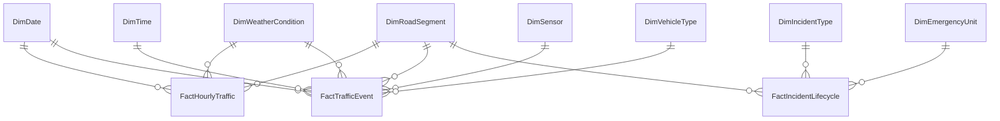
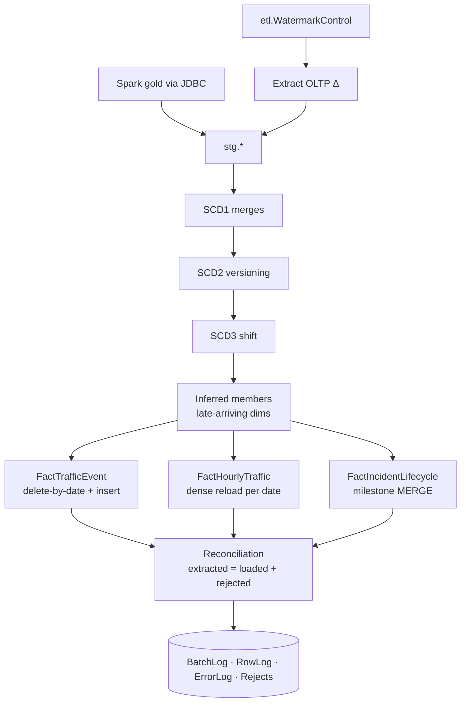
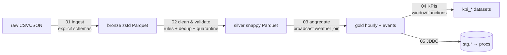

# Smart City Traffic Analytics Data Warehouse
### SQL Server ★ Apache Spark ★ Kimball Dimensional Modeling
*Design and Implementation of a Scalable Traffic Analytics Platform*

---

## 1 · The Problem

- 2,000+ sensors, cameras, signals → **tens of millions of events/day**
- Data trapped in operational silos (CSV feeds, JSON streams, dispatch OLTP)
- City can see *now*, but cannot answer *"what happens, where, why?"*
- Decisions on congestion, signals, investment and emergency staffing are made blind

**Goal:** one analytical platform — historical truth, conformed, fast to query.

---

## 2 · Architecture (Warehouse Layers)

```mermaid
flowchart LR
    subgraph Sources
        A1[Sensor CSV feeds]
        A2[Camera JSON events]
        A3[Weather JSON]
        A4[(TrafficOLTP<br/>dispatch & assets)]
    end
    subgraph Spark Lake — Parquet
        B[bronze<br/>immutable raw]
        S[silver<br/>clean · deduped · validated]
        G[gold<br/>hourly aggregates · KPIs]
    end
    subgraph SQL Server — TrafficDW
        ST[stg staging]
        DW[dim + fact<br/>star schema]
        M[mart views]
    end
    A1 & A2 & A3 --> B --> S --> G
    G -- JDBC --> ST
    A4 -- watermark extract --> ST
    ST --> DW --> M --> P[Power BI / reports / analysts]
```

**Division of labour:** Spark owns *volume* (parse/clean/aggregate),
SQL Server owns *conformance & serving* (SCD, star schema, BI concurrency).

---

## 3 · Kimball Bus Matrix (excerpt)

| Process → Fact | Grain | Type | Date | Time | Segment | Weather | VehType | Sensor | IncType | EmUnit |
|---|---|---|:-:|:-:|:-:|:-:|:-:|:-:|:-:|:-:|
| Vehicle detection | 1 detection | Transaction | ✔ | ✔ | ✔ | ✔ | ✔ | ✔ | | |
| Hourly monitoring | segment × hour | Periodic snapshot | ✔ | hour | ✔ | ✔ | | | | |
| Incident lifecycle | 1 incident | Accumulating | ✔×5 | ✔×5 | ✔ | ✔ | | | ✔ | ✔ |

---

## 4 · Star Schema



- Surrogate keys, unknown member (−1), inferred late-arriving members
- No snowflake: road + geography flattened into `DimRoadSegment`
- Role-playing DimDate/DimTime ×5 on the accumulating fact

---

## 5 · Three Fact Types — why each

| Fact | Type | Why this design |
|---|---|---|
| `FactTrafficEvent` | Transaction | Atomic event; lowest affordable grain; everything derivable from it |
| `FactHourlyTraffic` | Periodic snapshot | Dashboards ask hourly; records *zero-traffic* hours; pre-weighted measures |
| `FactIncidentLifecycle` | Accumulating snapshot | Pipeline with milestones; lags stored → SLA analysis without self-joins |

Lifecycle: **Detected → Dispatched → Arrived → Cleared → Closed** (5 role-playing date+time keys, updated in place).

---

## 6 · Slowly Changing Dimensions

| Type | Where | Example trigger |
|---|---|---|
| 0 retain | DimDate; InstallDate, Original limit | never changes |
| 1 overwrite | DimTrafficCamera | firmware upgrade |
| **2 add row** | DimRoadSegment, DimSensor | speed-limit change → new version, facts keep history |
| 3 add column | DimTrafficLight | Current vs Previous timing plan |
| 4/5 mini-dim | (documented) | volatile sensor status |
| 6 hybrid | CurrentSpeedLimitKmh on SCD2 dim | "vs limit then" AND "vs limit now" |

Implementation: `MERGE` + hash-diff + `OUTPUT` new-version insert; point-in-time fact joins on validity intervals.

---

## 7 · ETL Flow



Idempotent per date · rejects quarantined, never dropped · unknown member −1 everywhere.

---

## 8 · Spark Pipeline (Medallion)



- Both APIs on purpose: DataFrame API = plumbing, Spark SQL = business logic
- AQE, broadcast joins, partition overwrite = idempotent day re-runs
- **Why Spark, not SQL alone:** parallel parsing of 40–80M rows/day, native JSON, replayable bronze, cheap storage, data-science access

---

## 9 · Why Parquet

| | CSV | JSON | Parquet |
|---|---|---|---|
| Read 2 of 15 columns | full scan | full scan | **column chunks only** |
| Compression | poor | worst | **8–12× (dictionary+RLE+snappy)** |
| Skip irrelevant data | never | never | **min/max pushdown + partition pruning** |

Partitioned by `event_date` → a one-day query opens one directory.

---

## 10 · Advanced SQL Delivered

- **Window functions:** per-district Top-N (ROW_NUMBER), RANK vs DENSE_RANK, NTILE quartiles, running totals, 7-hour moving average, LAG day-over-day, PERCENTILE_CONT response SLAs
- **Multi-level aggregation:** ROLLUP subtotals, CUBE cross-tabs, GROUPING SETS dashboard extracts, GROUPING_ID labelling
- **Recursive CTEs:** jam propagation through the road graph, emergency route enumeration, date-gap detection
- **Top-N:** WITH TIES, per-group, TOP PERCENT, nested APPLY

Every query answers a catalogued business question → 14 mart views back the report catalogue.

---

## 11 · Performance

- **Columnstore:** clustered CCI on the event fact (compression + batch mode), NCCI on the snapshot (HTAP)
- **Partitioning:** monthly on DateKey; sliding-window `SWITCH` archival; partition elimination
- **SCD-aware indexing:** filtered unique index on `(BK) WHERE IsCurrent = 1`
- **Spark:** broadcast joins, AQE skew handling, Kryo, partition-aware writes, explicit schemas

---

## 12 · Beyond the Brief (and roadmap)

Included: **Airflow DAG** (backfill-aware orchestration) · **Docker Compose** (reproducible stack)
Next: **Delta Lake** on silver/gold (ACID + MERGE) → **Kafka + Structured Streaming** when latency demands it → **Power BI** semantic model on `mart` → ML congestion prediction from gold features.

---

## 13 · Takeaways

1. Two engines, one contract — Spark for volume, SQL Server for conformance.
2. Grain first, always — three fact types because three different business rhythms.
3. History is a feature — SCD2 + point-in-time joins make 2024 reports true forever.
4. Quality is architected, not hoped for — quarantine, reconciliation, unknown members.
